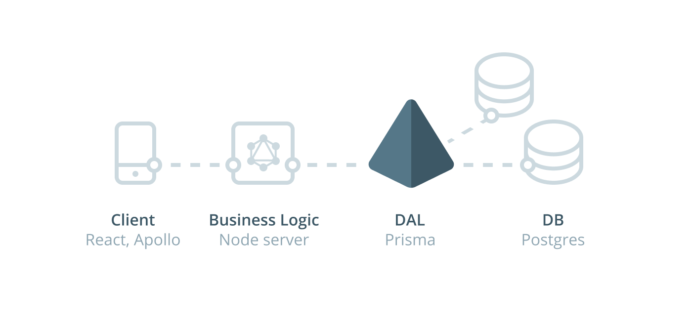
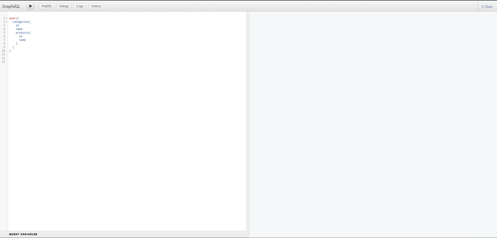
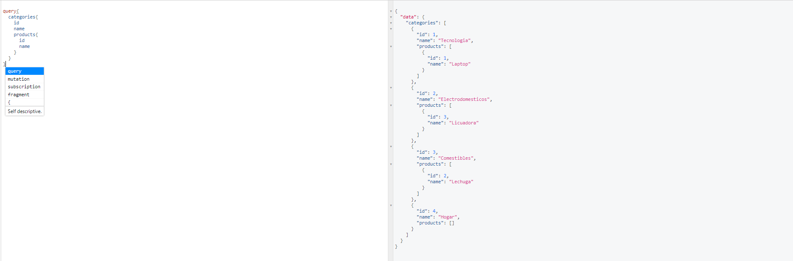
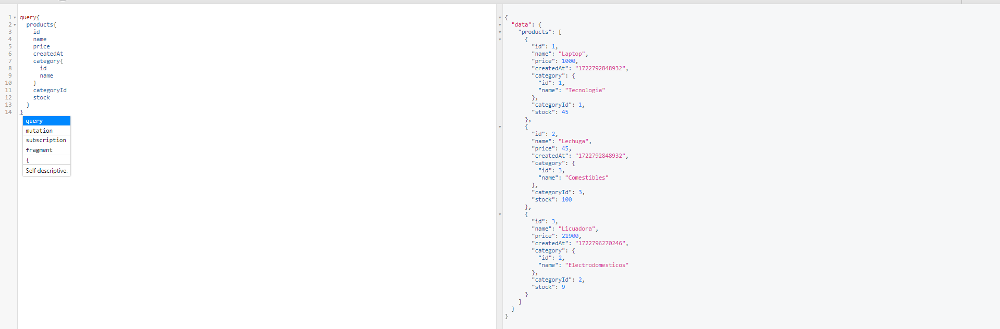
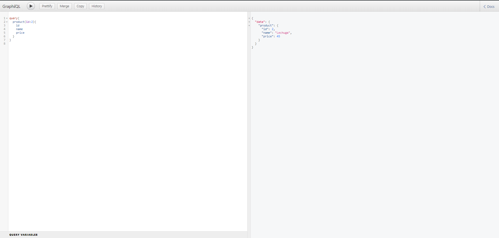
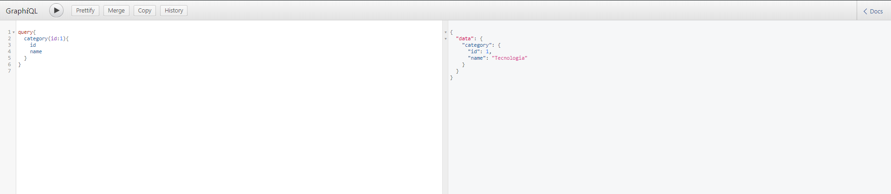
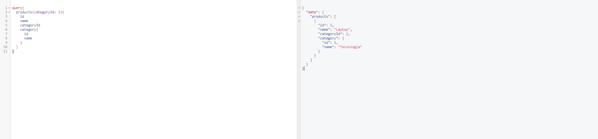
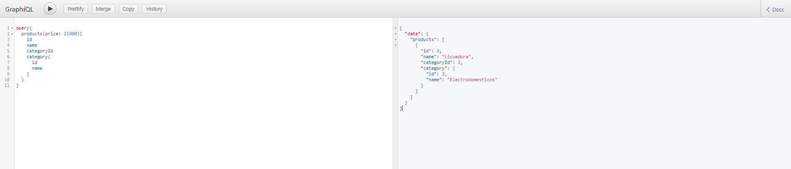
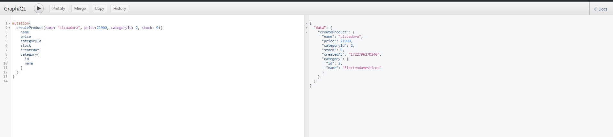

<h1 align="center">
  Prisma Guide
</h1>
<p align="center">
    
</p>


## 🧰 Setting up project Environment

* First, run the `npm install` on the root folder to install the dependencies of the project

* Second, make sure modify the connection string in the `.env` file, take reference from the `.env.example` file and change it according to your database connection.

* After that, run the `npm run dev` command to start

* Then navigate to [`http://127.0.0.1:3000/graphql`](http://127.0.0.1:3000/graphql) to start testing the querys.

This is the windows that's supposed to be displayed:
<p align="center">
    
</p>


## ✨ Query's Testing
<h3 align="center">
  All table data
</h3>

```bash
query{
  categories{
    id
    name
    products{
      id
      name
    }
  }
}
```
<p align="center">
    
</p>

```bash
query{
	products{
    id
    name
    price
    createdAt
    category{
      id
      name
    }
    categoryId
    stock
  }
}
```

<p align="center">
    
</p>

<h3 align="center">
  Specifica Data tables
</h3>

```bash
query{
  product(id:2){
    id
    name
    price
  }
}

```
<p align="center">
    
</p>

```bash
query{
  category(id:1){
    id
    name
  }
}

```

<p align="center">
    
</p>

<h3 align="center">
  Filter Data from Tables
</h3>

```bash
query{
	products(categoryId: 1){
    id
    name
    categoryId
    category{
      id
      name
    }
  }
}
```
<p align="center">
    
</p>

```bash
query{
	products(price: 24000){
    id
    name
    categoryId
    category{
      id
      name
    }
  }
}
```
<p align="center">
    
</p>

<h3 align="center">
  Mutations
</h3>

```bash
mutation{
  createProduct(name: "Licuadora", price:21900, categoryId: 1, stock: 4){
    name
    price
    categoryId
    stock
    createdAt
    category{
      id
      name
    }
  }
}
```
<p align="center">
    
</p>


## ⚠️ Disclaimer

> This project is oriented only to use a postgres database because it's , if you want to use other type of database, please check the corresponding documentation to adapt your project. > Refer to [Prisma Documentation](https://www.prisma.io/docs/getting-started) for setting up your favorite Database into your project.

> Please, make sure to add information to the database that you are using, wheter is postgres or any other kind of database. Also, remember to add information before executing the queries, because you may encounter problems when trying to execute them.
